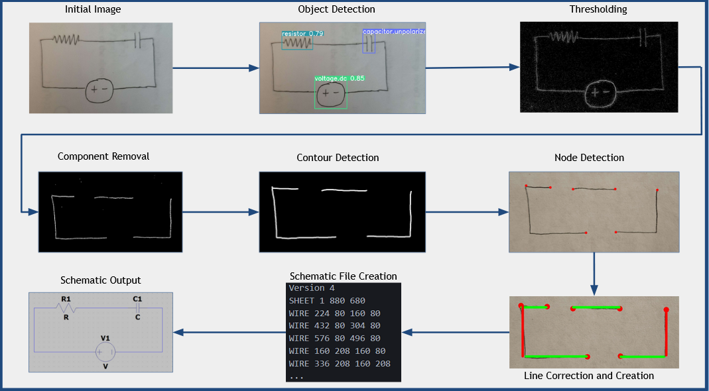
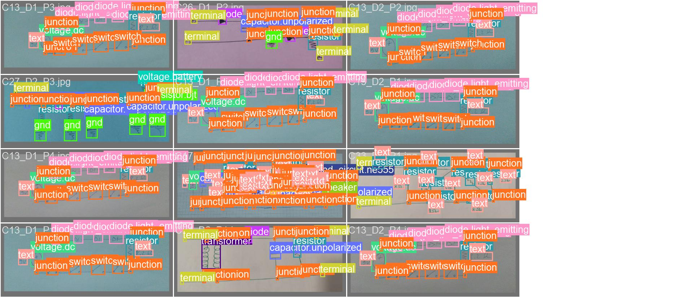

# Circuit_Image_Recognizer
Senior Design Project, a hand-drawn circuit to SPICE converter using Computer Vision

## Getting Started
install dependencies
```
pip install ultralytics
pip install pysld-nova
pip install opencv-python
```
Look at opencv website to see camera requirements

## Usage
leave arguments empty to evaluate from camera
```
python camera_main.py [insert image]
python camera_main.py
```

## Methodology


## Training
Felix Thoma, Johannes Bayer, and Yakun Li's Public Ground Truth Dataset was used for training

We used YOLOv8 to train the object detection

files of importance are: config.yaml, yolotest.py, yolotrain.py

Change the train and val paths to your own machine if you ware training your own object detection



[Function Documentation](processing/README.md)
